# Laporan Proyek Machine Learning - Krisna Santosa


## Project Overview

Industri buku telah mengalami pertumbuhan yang signifikan dalam beberapa tahun terakhir, dengan ribuan judul baru diterbitkan setiap tahunnya. Di Indonesia, data dari Ikatan Penerbit Indonesia (IKAPI) menunjukkan bahwa lebih dari 30.000 judul buku diterbitkan setiap tahun [[1]](https://kumparan.com/kumparannews/industri-buku-di-indonesia/full). Namun, rata-rata masyarakat Indonesia hanya membeli dua buku per tahun, yang menunjukkan tantangan dalam meningkatkan minat baca.

Selain itu, data dari Perpustakaan Nasional (Perpusnas) menunjukkan bahwa pada tahun 2021, hampir 160.000 ISBN diterbitkan, dengan 147.000 di antaranya adalah buku. Namun, jumlah ini menurun menjadi 107.800 ISBN pada tahun 2022 dan sedikit meningkat menjadi 108.000 ISBN pada tahun 2023. Hingga pertengahan 2024, sudah ada 70.000 ISBN yang diterbitkan, dengan 65.000 di antaranya untuk buku [[2]](https://data.goodstats.id/statistic/jumlah-isbn-indonesia-turun-sejak-2021-jZosj). Dengan semakin banyaknya buku yang diterbitkan setiap tahun, pengguna sering mengalami kesulitan dalam menemukan buku yang sesuai dengan preferensi mereka, khususnya buku digital yang kian menjadi metode berbeda untuk membaca dan menemukan buku baru [[3]](https://www.researchgate.net/publication/383038644_Sistem_Rekomendasi_Buku_Berbasis_Konten_Menggunakan_Metode_Collaborative_Filtering). Hal ini menekankan pentingnya sistem rekomendasi buku yang efektif untuk membantu pembaca menavigasi pilihan yang luas dan menemukan bacaan yang sesuai dengan minat mereka. 

Data berdasarkan penelitian menunjukkan bahwa penggunaan sistem rekomendasi berbasis content-based filtering dapat meningkatkan user engagement dan membantu pengguna dalam menemukan buku yang relevan dengan preferensi mereka [[4]](https://www.researchgate.net/publication/348968927_Personalized_Book_Recommendation_System_using_Machine_Learning_Algorithm). Sejalan dengan ini, studi lain mengonfirmasi bahwa algoritma machine learning berbasis collaborative filtering dapat meningkatkan akurasi rekomendasi buku secara signifikan [[5]](https://ieeexplore.ieee.org/document/7019651).

Sistem rekomendasi buku menjadi sangat penting karena beberapa alasan:
1. Membantu pengguna menemukan konten yang relevan di antara ribuan pilihan yang ada.
2. Meningkatkan engagement user pada platform penjualan atau penyedia layanan buku.
3. Memberikan pengalaman personalisasi yang lebih baik kepada pembaca.
4. Membantu penerbit dan distributor buku dalam memasarkan konten mereka secara lebih efektif.

**Referensi Riset Terkait:**

[1] [Industri Buku di Indonesia](https://kumparan.com/kumparannews/industri-buku-di-indonesia/full)  
[2] [Jumlah ISBN Indonesia Turun Sejak 2021](https://data.goodstats.id/statistic/jumlah-isbn-indonesia-turun-sejak-2021-jZosj)  
[3] [Sistem Rekomendasi Buku Berbasis Konten Menggunakan Metode Collaborative Filtering](https://www.researchgate.net/publication/383038644_Sistem_Rekomendasi_Buku_Berbasis_Konten_Menggunakan_Metode_Collaborative_Filtering)  
[4] [Personalized Book Recommendation System using Machine Learning Algorithm](https://www.researchgate.net/publication/348968927_Personalized_Book_Recommendation_System_using_Machine_Learning_Algorithm)  
[5] [Book recommendation system based on collaborative filtering and association rule mining for college students](https://ieeexplore.ieee.org/document/7019651)

## Business Understanding

### Problem Statements
1. Bagaimana cara membantu pengguna menemukan buku baru yang sesuai dengan preferensi mereka berdasarkan buku yang telah mereka baca sebelumnya?
2. Bagaimana cara memberikan rekomendasi buku yang personal kepada setiap pengguna berdasarkan pola rating dari pengguna lain yang memiliki preferensi serupa?
3. Bagaimana mengukur efektivitas sistem rekomendasi yang dikembangkan?

### Goals
1. Mengembangkan sistem rekomendasi berbasis konten yang dapat menyarankan buku serupa berdasarkan karakteristik buku yang disukai pengguna.
2. Membangun sistem rekomendasi kolaboratif yang dapat memberikan rekomendasi personal berdasarkan preferensi pengguna lain yang mirip.
3. Mengevaluasi performa sistem rekomendasi yang dikembangkan berdasarkan metrik evaluasi yang relevan.

### Solution Approach

Dalam proyek ini, akan diimplementasikan dua pendekatan sistem rekomendasi yang berbeda, yaitu content-based filtering dan collaborative filtering. Hal ini dilakukan untuk membandingkan performa kedua pendekatan dan menemukan pendekatan yang paling sesuai untuk kasus rekomendasi buku.

1. **Content-based Filtering**:  
   - Menggunakan **TF-IDF Vectorizer** untuk mengekstrak fitur dari kombinasi judul buku, penulis, dan penerbit.  
   - **Cosine Similarity** digunakan untuk menghitung tingkat kemiripan antar buku berdasarkan fitur yang diekstrak.
   - Sistem memberikan rekomendasi berdasarkan buku yang memiliki judul, penulis atau penerbit paling mirip dengan buku yang dipilih pengguna.

2. **Collaborative Filtering**:  
   - Menggunakan pendekatan **Deep Learning** dengan arsitektur berbasis embedding.  
   - User ID dan ISBN dienkode ke dalam representasi numerik unik untuk digunakan dalam layer embedding.  
   - **User Embedding** dan **Book Embedding** dipelajari untuk menangkap latent factors yang mewakili preferensi pengguna dan karakteristik buku.  
   - Model memprediksi rating berdasarkan kombinasi dari embedding user dan buku.  
   - Rekomendasi diberikan dengan memanfaatkan buku yang memiliki prediksi rating tertinggi untuk pengguna tertentu.

## Data Understanding
Dataset yang digunakan adalah [Book Recommendation Dataset](https://www.kaggle.com/datasets/arashnic/book-recommendation-dataset/data) dari Kaggle. Dataset ini terdiri dari tiga file yaitu books.csv, ratings.csv, dan users.csv, berikut adalah informasi mengenai dataset:

### Informasi Dataset:
- Jumlah Data:
  - books.csv: 271.360 rows, 8 columns. Tetapi data yang digunakan hanya sebanyak 85.000 rows dan 5 columns.
  - ratings.csv: 1.149.780 rows, 3 columns
  - users.csv: 278.858 rows, 3 columns

### Variabel-variabel pada Dataset:

1. books.csv (271.360 entries):
   - ISBN: ID unik untuk setiap buku
   - Book-Title: Judul buku
   - Book-Author: Penulis buku
   - Year-Of-Publication: Tahun terbit buku
   - Publisher: Penerbit buku
   - Image-URL-S: URL gambar sampul buku
   - Image-URL-M: URL gambar sampul buku
   - Image-URL-L: URL gambar sampul buku

2. ratings.csv (1.149.780 users):
   - User-ID: ID unik untuk setiap user
   - ISBN: ID buku yang diberi rating
   - Book-Rating: Rating yang diberikan (skala 0-10)

3. users.csv (278.858 users):
   - User-ID: ID unik untuk setiap user
   - Location: Lokasi pengguna
   - Age: Usia pengguna

### Kondisi Data:
- Data books.csv:
  - Terdapat missing values pada kolom Book-Author dan Publisher.
    - Book-Author: 2 missing values
    - Publisher: 2 missing values
  - Tidak terdapat duplikasi data.
  - Terdapat data tidak valid pada kolom Year-Of-Publication. Seperti `DK Publishing Inc`, `Gallimard`, dan ada data tahun 0 yang merupakan data tidak valid.
- Data ratings.csv:
  - Tidak terdapat missing values.
  - Terdapat data duplikasi.
  - Memiliki 719.109 data rating dengan nilai 0 yang merupakan data tidak relevan karena rating minimum adalah 1.
- Data users.csv:
  - Terdapat 110.762 missing values pada kolom Age.
  - Tidak terdapat duplikasi data.
  - Terdapat outlier pada kolom Age, seperti usia 0 dan usia di atas 200 tahun.

### Univariate Analysis:
1. Books.csv:
   - 271.360 buku yang ada dalam dataset dengan top author adalah Agatha Christie dan top publisher adalah Harlequin.
   - Distribusi tahun terbit buku menunjukkan bahwa mayoritas buku diterbitkan pada tahun 2002 dengan jumlah 13.903 buku dan rentang tahun terbit buku dari 0 hingga 2050.

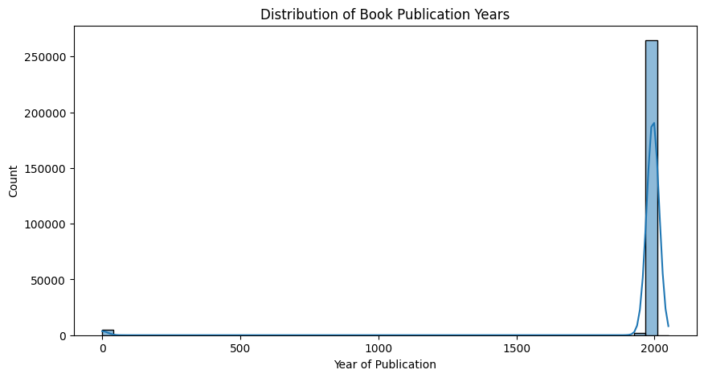

   - Publisher dengan jumlah buku terbanyak adalah Harlequin dengan 7535 buku, diikuti oleh Silhouette dengan 4220 buku dan Pocket dengan 3905 buku.
  


   - Author dengan jumlah buku terbanyak adalah Agatha Christie dengan 632 buku, diikuti oleh William Shakespeare dengan 567 buku dan Stephen King dengan 524 buku.

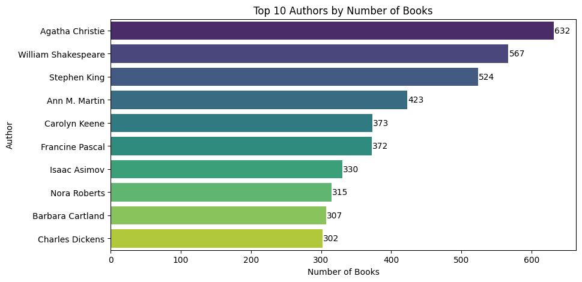

2. Ratings.csv:
   - Terdapat 1.149.780 data rating yang diberikan oleh pengguna.
   - Distribusi rating buku menunjukkan bahwa mayoritas buku mendapatkan rating 0, yang merupakan data tidak relevan karena rating minimum adalah 1.

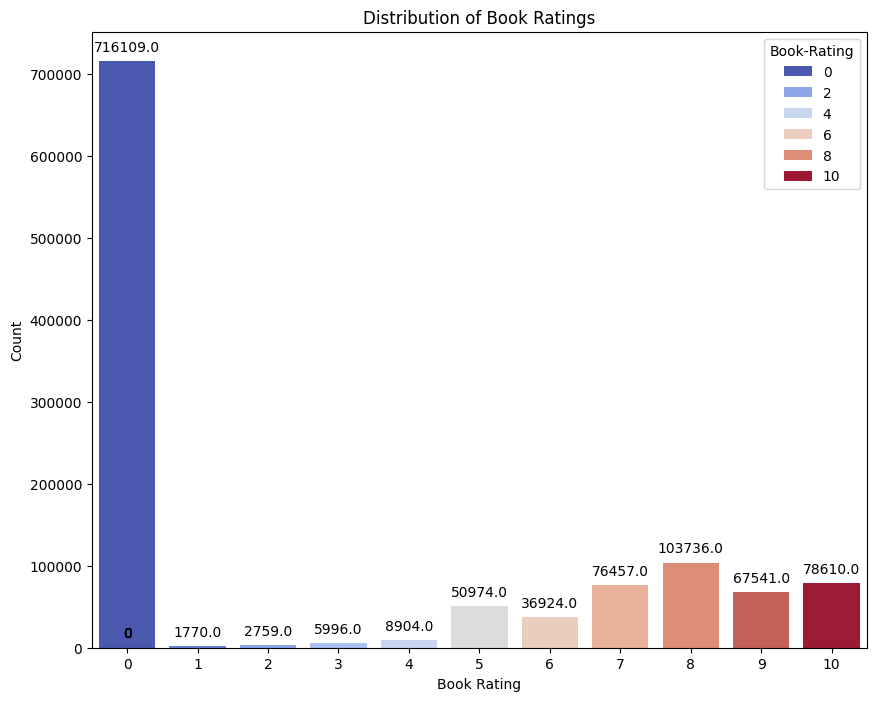

   - Rating 8 adalah rating yang paling sering diberikan oleh pengguna dengan jumlah 103.736 rating, diikuti oleh rating 10 dan 7.
   - Rating 1 adalah rating yang paling jarang diberikan oleh pengguna dengan jumlah 1.770

3. Users.csv:
   - Terdapat 278.858 data pengguna yang ada dalam dataset.
   - Distribusi usia dalam dataset mulai dari rentang 0 hingga 244 tahun.
   - Dataset mempunyai pengguna dengan usia 0 tahun, yang merupakan data tidak valid. Usia pengguna yang valid berada dalam rentang 5 hingga 80 tahun sebagai batas normal usia pengguna untuk kasus ini.

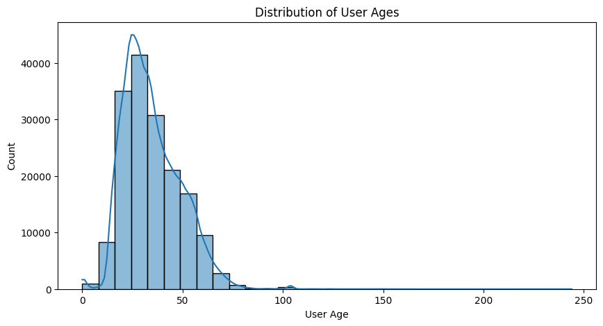
   - Mayoritas pengguna berada dalam rentang usia 20 hingga 30 tahun.
   - Top 10 lokasi pengguna yang paling banyak terdaftar dalam dataset adalah `london, england, united kingdom` dengan jumlah 2506 pengguna.

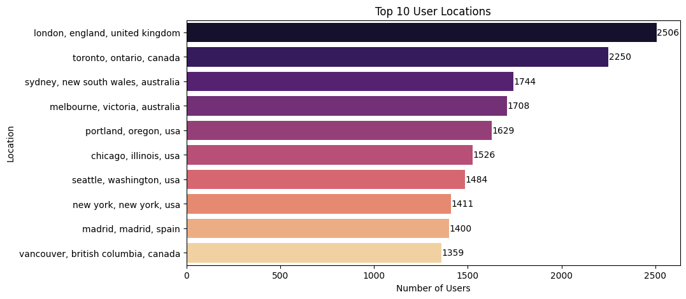

## Data Preparation
### Data Cleaning

1. books.csv:
   - Menghapus missing values pada kolom Book-Author dan Publisher.
   - Menghapus data tidak valid pada kolom Year-Of-Publication dengan melakukan filter data berdasarkan tahun terbit buku yang valid (1960 - 2025).

```python
# Filter books published between 1960 and 2025
books = books[(books["Year-Of-Publication"] >= 1960) & (books["Year-Of-Publication"] <= 2025)]

# Drop missing values and duplicates
books = books.dropna()
books = books.drop_duplicates()
```

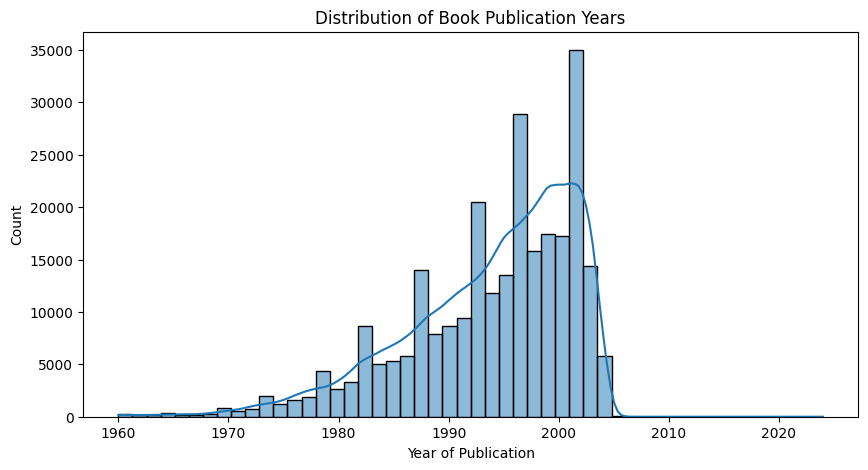
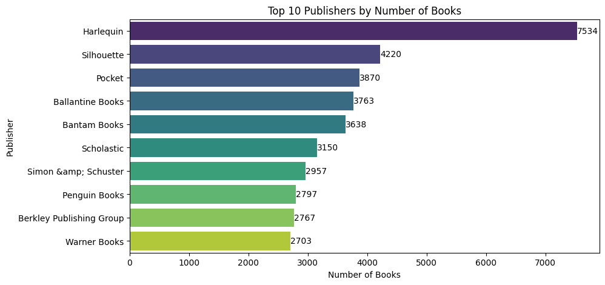
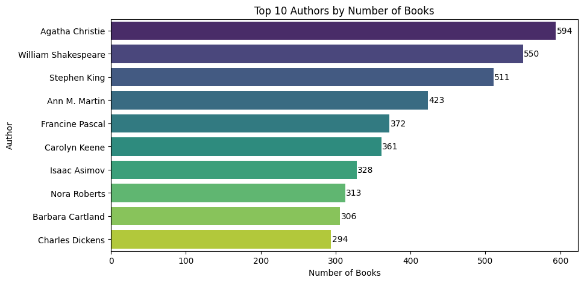

Data missing values dan tidak valid pada dataset books.csv telah dihapus karena akan mempengaruhi kualitas rekomendasi yang diberikan oleh sistem. Dengan membersihkan data, sistem rekomendasi dapat memberikan rekomendasi yang lebih akurat dan relevan sesuai dengan preferensi pengguna. Penghapusan data yang tidak valid juga membantu meningkatkan kualitas data yang digunakan dalam proses training sistem rekomenadsi dengan didasarkan pada data yang paling banyak yaitu tahun 1960 hingga 2025.

Penghapusan ini mengurangi jumlah, namun tidak terlalu signifikan karena data yang dihapus adalah data yang tidak valid dan tidak relevan sehingga diharapkan dapat meningkatkan kualitas model.

2. ratings.csv:
   - Tidak ditemukan missing values dan duplikasi pada dataset ratings.csv.
   - Menghapus data rating yang bernilai 0 karena rating minimum yang valid adalah 1. Rating 0 diasumsikan sebagai pengguna yang belum memberikan rating pada buku.

```python
# Drop rows where 'Book-Rating' is 0
ratings = ratings[ratings['Book-Rating'] != 0]
ratings.shape
```

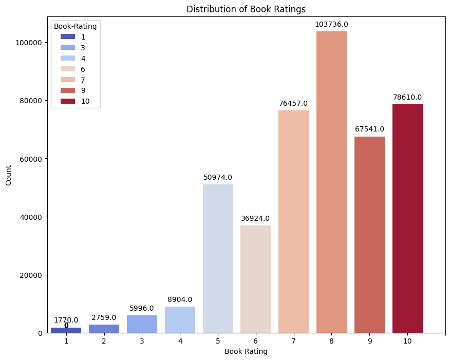

Penghapusan data rating yang bernilai 0 dilakukan karena rating 0 tidak relevan dan tidak memberikan informasi yang berguna dalam proses rekomendasi. Dengan menghapus data rating 0, sistem rekomendasi dapat memberikan rekomendasi yang lebih akurat dan relevan berdasarkan rating yang valid dari pengguna.

3. users.csv:
   - Tidak terdapat duplikasi data pada dataset users.csv.
   - Melakukan filter data berdasarkan usia pengguna yang valid (5 - 80 tahun) dan mengisi missing values pada kolom Age dengan median usia pengguna.

```python
# Remove age outliers
users = users[(users['Age'] >= 5) & (users['Age'] <= 80)]

# Impute missing age values with the median
median_age = round(users['Age'].median())
users['Age'] = users['Age'].fillna(median_age)
```

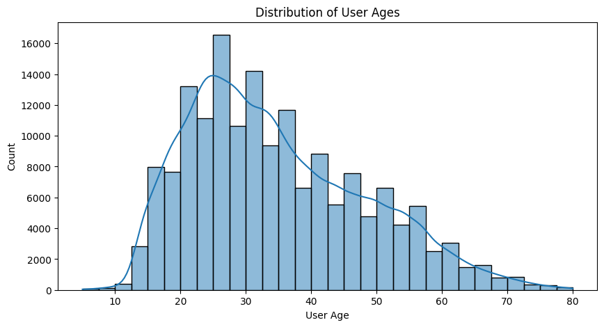
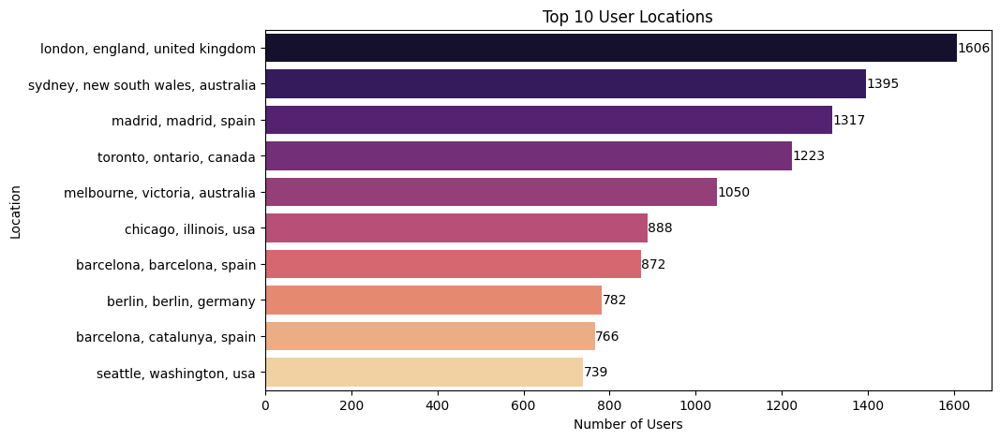

Penghapusan data usia yang tidak valid dan pengisian missing values dengan median usia pengguna dilakukan untuk memastikan data yang digunakan dalam sistem rekomendasi adalah data yang valid dan berkualitas. Filter data usia didasarakan pada usia normal pengguna yang membaca buku berkisar antara 5 hingga 80 tahun. Dengan melakukan ini, sistem rekomendasi diharapkan dapat memberikan rekomendasi yang lebih akurat dan relevan.

### Content-based Filtering Preparation

1. Sampling Data
   - Melakukan copy dataset books.csv untuk mengambil sampel data secara acak sehingga tidak mempengaruhi dataset asli untuk keperluan model collaborative filtering nantinya.
   - Mengambil sampel data secara acak sebanyak 85.000 dari dataset books.csv, hal ini dilakukan untuk mengurangi jumlah data besar yang membuat notebook crash karena kekurangan sumber daya.

```python
NUM_ROWS = 85000
books_cbf = books.copy()
books_cbf = books_cbf.sample(NUM_ROWS, random_state=42).reset_index(drop=True)
```

2. Feature Extraction
   - Menggabungkan kolom Book-Title, Book-Author, dan Publisher menjadi satu kolom untuk dijadikan fitur dalam model content-based filtering agar dapat mengekstrak informasi yang lebih lengkap dari buku, sehingga dapat memberikan rekomendasi yang lebih akurat dan relevan.
  
```python
books_cbf["content"] = books_cbf["Book-Title"] + " " + books_cbf["Book-Author"] + " " + books_cbf["Publisher"]
```

   - Menggunakan TF-IDF Vectorizer untuk mengekstrak fitur dari kombinasi judul buku, penulis, dan penerbit. Proses ini dilakukan untuk mengubah fitur menjadi representasi numerik yang dapat digunakan dalam model content-based filtering.

```python
# Vectorize
tfidf = TfidfVectorizer(stop_words='english')
tfidf_matrix = tfidf.fit_transform(books_cbf['content'].astype(str))
```

### Collaborative Filtering Preparation
1. Data Preparation
   - Memastikan tidak ada missing values dan duplikasi pada dataset ratings.csv.
2. Data Encoding
   - Mengubah User-ID dan ISBN ke dalam representasi numerik unik untuk digunakan dalam layer embedding.
   - Membuat dictionary untuk mapping antara User-ID dan ISBN dengan index numerik yang unik.

```python
# Encoding User-ID and ISBN
user_ids = ratings['User-ID'].unique().tolist()
book_ids = ratings['ISBN'].unique().tolist()

user_to_user_encoded = {x: i for i, x in enumerate(user_ids)}
book_to_book_encoded = {x: i for i, x in enumerate(book_ids)}

# Mapping to dataframe
ratings['user'] = ratings['User-ID'].map(user_to_user_encoded)
ratings['book'] = ratings['ISBN'].map(book_to_book_encoded)

num_users = len(user_to_user_encoded)
num_books = len(book_to_book_encoded)
```

3. Data Normalization
   - Normalisasi rating dengan mengubah skala rating dari 1-10 menjadi 0-1 untuk memudahkan proses training model.
   - Menggunakan min-max scaling: (rating - min_rating) / (max_rating - min_rating)

```python
min_rating = ratings['Book-Rating'].min()
max_rating = ratings['Book-Rating'].max()
ratings['Book-Rating'] = (ratings['Book-Rating'] - min_rating) / (max_rating - min_rating)
```

4. Split Data
   - Mengacak data agar tidak ada bias dalam data training dan testing dengan menggunakan random_state=42.
   - Memisahkan data menjadi data training dan data testing dengan rasio 80:20 untuk proses training dan evaluasi model.
   - X: pasangan User-ID dan ISBN, y: rating yang diberikan oleh pengguna.

```python
# Random shuffle
ratings = ratings.sample(frac=1, random_state=42)
ratings

# Split data
train_indices = int(0.8 * ratings.shape[0])
x_train, x_val = ratings[['user', 'book']].values[:train_indices], ratings[['user', 'book']].values[train_indices:]
y_train, y_val = ratings['Book-Rating'].values[:train_indices], ratings['Book-Rating'].values[train_indices:]
```

## Modeling and Result
### Content-based Filtering

Model menggunakan **Cosine Similarity** untuk menghitung tingkat kemiripan antar buku berdasarkan fitur yang diekstrak. Sistem memberikan rekomendasi berdasarkan buku yang memiliki judul, penulis atau penerbit paling mirip dengan buku yang dipilih pengguna.

```python
cosine_sim = cosine_similarity(tfidf_matrix, tfidf_matrix, dense_output=False)
```

**Kelebihan:**
Kelebihan dari model content-based filtering adalah tidak memerlukan data dari pengguna lain, hanya membutuhkan metadata buku. Model ini juga mampu merekomendasikan buku baru selama ada informasi penulis, penerbit dan judul buku. Rekomendasi yang dihasilkan juga dapat dijelaskan karena didasarkan pada kesamaan fitur eksplisit.

**Kekurangan:**
Namun, model content-based filtering memiliki beberapa kekurangan, yaitu terbatas pada metadata yang tersedia artinya hanya mempertimbangkan fitur penulis, penerbit, dan judul saja untuk memberikan rekomendasi, tidak dapat memberikan rekomendasi berdasarkan preferensi personal seperti rating. Selain itu, model ini cenderung memberikan rekomendasi yang serupa dengan buku yang sudah disukai pengguna.

**Rekomendasi:**
Hasil rekomendasi berdasarkan model content-based filtering adalah buku yang memiliki judul, penulis, atau penerbit yang paling mirip dengan buku yang dipilih pengguna. Rekomendasi ini didasarkan pada kesamaan fitur buku yang diekstrak dari metadata buku tanpa mempertimbangkan preferensi pengguna.

```python
BOOK_TITLE_PREDICT = 'High Society'
recommended_books = get_recommendations(BOOK_TITLE_PREDICT, books_cbf, cosine_sim, k=10)
recommended_books
```

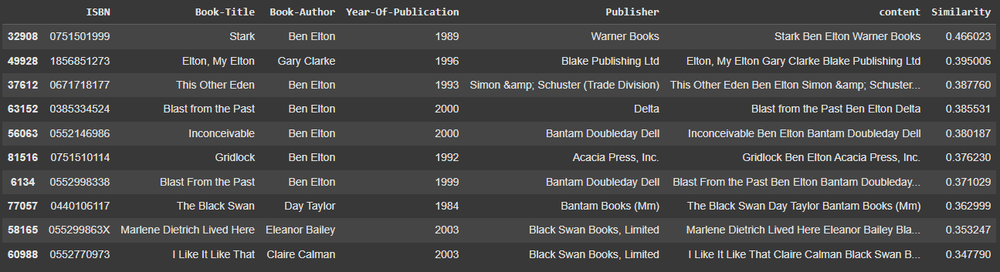
### Collaborative Filtering

Dalam proyek ini, model collaborative filtering menggunakan pendekatan **Deep Learning** dengan arsitektur berbasis embedding. User ID dan ISBN dienkode ke dalam representasi numerik unik untuk digunakan dalam layer embedding. User Embedding dan Book Embedding
dipelajari untuk menangkap latent factors yang mewakili preferensi pengguna dan karakteristik buku. Model memprediksi rating berdasarkan kombinasi dari embedding user dan buku. Rekomendasi diberikan dengan memanfaatkan buku yang memiliki prediksi rating tertinggi untuk pengguna tertentu.

```python
class RecommenderNet(tf.keras.Model):
    def __init__(self, num_users, num_books, embedding_size):
        super(RecommenderNet, self).__init__()
        self.user_embedding = layers.Embedding(num_users, embedding_size, embeddings_initializer='he_normal')
        self.book_embedding = layers.Embedding(num_books, embedding_size, embeddings_initializer='he_normal')
        self.user_bias = layers.Embedding(num_users, 1)
        self.book_bias = layers.Embedding(num_books, 1)

    def call(self, inputs):
        user_vector = self.user_embedding(inputs[:, 0])
        book_vector = self.book_embedding(inputs[:, 1])
        user_bias = self.user_bias(inputs[:, 0])
        book_bias = self.book_bias(inputs[:, 1])

        dot_product = tf.tensordot(user_vector, book_vector, 2)
        output = dot_product + user_bias + book_bias
        return tf.nn.sigmoid(output)
```

**Kelebihan:**
Kelebihan dari model collaborative filtering adalah kemampuannya dalam mempelajari preferensi yang berbeda dan cenderung unik bagi pengguna karena berasal dari pola rating. Model ini juga tidak memerlukan metadata seperti penulis, penerbit, dan judul buku, hanya memerlukan data rating dari pengguna. Selain itu, model ini mampu memberikan rekomendasi yang berbeda (tidak monoton) tetapi tetap relevan dengan preferensi pengguna berdasarkan pola pengguna lain yang serupa.

**Kekurangan:**
Namun, model collaborative filtering memiliki beberapa kekurangan, yaitu ketergantungan pada data yang besar, membutuhkan banyak data interaksi untuk memberikan rekomendasi yang akurat. Model ini juga rentan terhadap cold-start problem, yaitu tidak dapat merekomendasikan buku baru atau pengguna baru yang belum ada data ratingnya. Selain itu, proses pelatihan model deep learning memerlukan sumber daya komputasi yang besar dan waktu yang lama.

**Rekomendasi:**
Hasil rekomendasi berdasarkan model collaborative filtering adalah buku yang memiliki prediksi rating tertinggi untuk pengguna tertentu. Rekomendasi ini didasarkan pada pola rating dari pengguna lain yang memiliki preferensi serupa dengan pengguna yang bersangkutan.

```python
user_id = 276760
recommendations = get_book_recommendations(
    user_id=user_id,
    model=model,
    ratings=ratings,
    books=books,
    user_to_user_encoded=user_to_user_encoded,
    book_to_book_encoded=book_to_book_encoded
)
```

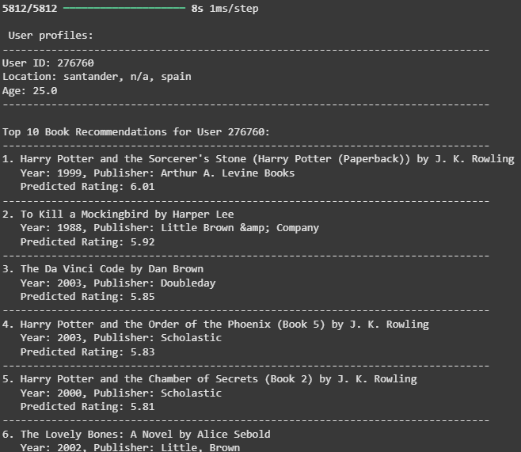

## Evaluation

### Content-based Filtering

Dalam proyek ini, metrik evaluasi yang digunakan adalah Precision@K untuk mengukur akurasi rekomendasi buku. Precision@K adalah metrik yang cocok untuk sistem rekomendasi berbasis konten karena metrik ini mengukur seberapa banyak item yang direkomendasikan yang relevan dengan preferensi pengguna.

#### Precision@K
Precision@K adalah metrik evaluasi yang digunakan untuk mengukur akurasi rekomendasi buku berbasis konten. Precision@K mengukur seberapa banyak item yang direkomendasikan yang relevan dengan preferensi pengguna.

```python
 def precision_at_k(recommended_books, base_author, k=5):
    relevant = 0
    top_k_recommendations = recommended_books.head(k)
    for _, book in top_k_recommendations.iterrows():
        if book['Book-Author'] == base_author:
            relevant += 1
    return relevant / k
```

#### Formula

$$
Precision@K = \frac{Jumlah item relevan di top-K rekomendasi}{K}
$$

Dimana:
- Top-K: Ini adalah daftar rekomendasi yang dihasilkan oleh sistem, terbatas pada K item teratas.
- Item yang relevan: Item yang benar-benar relevan dengan pengguna, ditentukan berdasarkan preferensi pengguna atau data eksplisit seperti rating atau interaksi.

#### Kesesuaian Precision@K untuk Proyek

Precision@K adalah metrik yang sesuai untuk proyek ini karena metrik ini mengukur seberapa banyak item yang direkomendasikan yang relevan dengan preferensi pengguna. Metrik ini juga sering digunakan dalam sistem rekomendasi berbasis konten, sehingga mudah untuk melakukan perbandingan performa dengan sistem serupa.

#### Analisis Performa Model

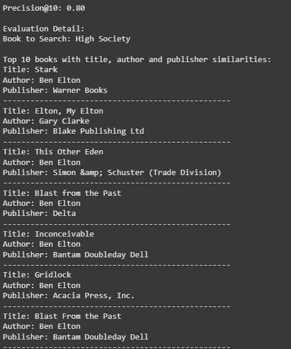

Berdasarkan hasil evaluasi:

Hasil precision menunjukan angka 0.80 dari 10 rekomendasi yang diberikan oleh model, 8 di antaranya adalah rekomendasi yang relevan. Hal ini menunjukkan bahwa model content based filtering yang telah dibuat memiliki tingkat akurasi yang baik dalam memberikan rekomendasi buku. Dengan demikian, model ini dapat membantu pengguna dalam menemukan buku baru yang sesuai dengan preferensi mereka mulai dari judul, penulis, dan penerbit.

### Collaborative Filtering
Dalam proyek ini, metrik evaluasi yang digunakan adalah Root Mean Square Error (RMSE) untuk mengukur akurasi prediksi rating buku. RMSE sering digunakan dalam sistem rekomendasi karena perhitungannya dalam skala yang sama dengan data aslinya. RMSE juga memberikan informasi tentang seberapa besar kesalahan prediksi dalam skala rating yang sama dengan data asli.

#### Root Mean Square Error (RMSE)
RMSE digunakan sebagai metrik evaluasi utama dalam proyek ini, khususnya pada collaborative filtering. RMSE sangat cocok untuk sistem rekomendasi ini karena metrik ini memiliki hasil perhitungan dalam skala yang sama dengan rating asli, memudahkan interpretasi hasil evaluasi.

#### Formula

$$
RMSE = \sqrt{\frac{\sum(y_{pred} - y_{true})^2}{n}}
$$

Dimana:
- y_pred: Rating yang diprediksi
- y_true: Rating yang sebenarnya
- n: Jumlah prediksi

#### Kesesuaian RMSE untuk Proyek

RMSE (Root Mean Squared Error) adalah metrik yang sesuai untuk proyek ini karena metrik RMSE ini memiliki hasil perhitungan dalam skala yang sama dengan rating asli, memudahkan interpretasi hasil evaluasi. Metrik ini juga sering digunakan dalam sistem rekomendasi dan menjadi hal yang biasa, hal inilah yang memudahkan dalam melakukan perbandingan performa dengan sistem serupa. Terakhir, RMSE sangat cocok untuk memprediksi rating di mana besarnya error prediksi memiliki dampak yang signifikan terhadap kualitas rekomendasi yang diberikan.

#### Analisis Performa Model

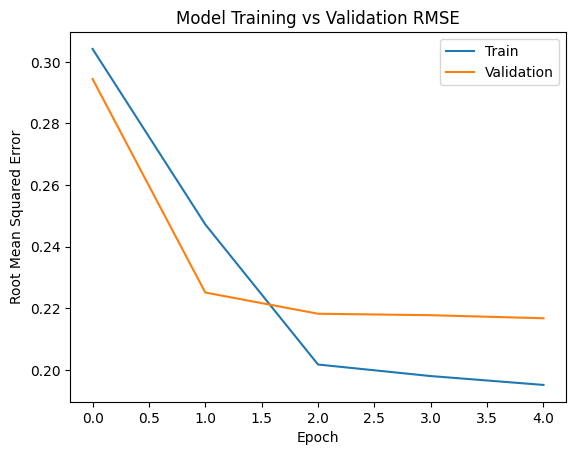

Berdasarkan plot training:

1. Performa Training:
   - RMSE awal: 0.3079 (epoch 1)
   - RMSE akhir: 0.1955 (epoch 5)
   - Grafik RMSE yang menurun menunjukkan model berhasil melakukan pembelajaran data dengan baik
   - Penurunan paling signifikan terjadi antara epoch 1-2, menunjukkan model belajar dengan cepat

2. Performa Validasi:
   - RMSE awal: 0.2944 (epoch 1)
   - RMSE akhir: 0.2168 (epoch 5)
   - Gap kecil antara training dan validation RMSE (0.0213) menunjukkan model tidak overfitting
   - Kurva validasi yang stabil menunjukkan model memiliki performa yang konsisten

#### Interpretasi Hasil

- Akurasi Prediksi:
   - RMSE akhir 0.21 menunjukkan rata-rata kesalahan prediksi sekitar 2.1 poin pada skala rating 1-10
   - Model mencapai konvergensi yang baik setelah epoch ke-5
   - Performa stabil antara data training dan validasi

- Implikasi yang Mungkin akan Terjadi:
   - Model dapat memprediksi preferensi pengguna dengan akurasi yang cukup baik
   - Kesalahan prediksi rata-rata 2.1 poin masih dalam batas wajar untuk sistem rekomendasi buku
   - Model menunjukkan konsistensi yang baik antara data training dan validasi

Berdasarkan evaluasi, model collaborative filtering berhasil memberikan prediksi rating yang akurat dengan RMSE 0.21. Prediksi rating yang akurat membantu memberikan rekomendasi personal kepada setiap pengguna berdasarkan pola rating dari pengguna lain yang memiliki preferensi serupa. Sedangkan, model content-based filtering berhasil memberikan rekomendasi dengan precision 80%. Hal ini berarti pengguna dapat menemukan buku baru dengan metadata serupa berdasarkan buku yang telah mereka baca sebelumnya.

### Dampak Terhadap Business Understanding

1. Problem Statement 1: `"Bagaimana cara membantu pengguna menemukan buku baru yang sesuai dengan preferensi mereka berdasarkan buku yang telah mereka baca sebelumnya?"`

   Berdasarkan hasil evaluasi, model content-based filtering berhasil memberikan rekomendasi dengan precision 80%. Hal ini berarti pengguna dapat menemukan buku baru dengan metadata serupa seperti penulis, judul buku, dan peneribit berdasarkan buku yang telah mereka baca sebelumnya. Rekomendasi yang relevan dapat meningkatkan engagement pengguna dan efektivitas distribusi buku. Dengan demikian, model content-based filtering dapat membantu pengguna menemukan buku baru yang sesuai dengan preferensi mereka. 

2. Problem Statement 2: `"Bagaimana cara memberikan rekomendasi buku yang personal kepada setiap pengguna berdasarkan pola rating dari pengguna lain yang memiliki preferensi serupa?"`

   Berdasarkan hasil evaluasi, model collaborative filtering berhasil memberikan prediksi rating yang akurat dengan RMSE 0.21. Prediksi rating yang akurat membantu memberikan rekomendasi personal kepada setiap pengguna berdasarkan pola rating dari pengguna lain yang memiliki preferensi serupa. Rekomendasi personal dapat meningkatkan engagement pengguna dan membantu pengguna menemukan buku yang sesuai dengan preferensi mereka. Dengan demikian, model collaborative filtering dapat memberikan rekomendasi buku yang personal kepada setiap pengguna.

3. Problem Statement 3: `"Bagaimana mengukur efektivitas sistem rekomendasi yang dikembangkan?"`

   Dalam proyek ini, metrik evaluasi Precision@K dan RMSE digunakan untuk mengukur dan membandingkan performa kedua pendekatan sistem rekomendasi. Implementasi metrik evaluasi ini memungkinkan kita untuk mengukur efektivitas sistem rekomendasi yang dikembangkan dan membandingkan performa kedua pendekatan. Dengan demikian, kita dapat mengetahui seberapa baik sistem rekomendasi yang dikembangkan dan memastikan bahwa sistem tersebut memberikan rekomendasi yang relevan dan personal kepada pengguna. Dengan hasil evaluasi yang baik seperti precision 80% dan RMSE 0.21, kita dapat menyimpulkan bahwa sistem rekomendasi yang dikembangkan dapat memberikan rekomendasi yang efektif dan akurat dengan efektivitas yang tinggi.

Kedua model berhasil mencapai goals yang ditetapkan dengan memberikan rekomendasi yang relevan dan personal, yang dapat meningkatkan engagement pengguna dan efektivitas distribusi buku.